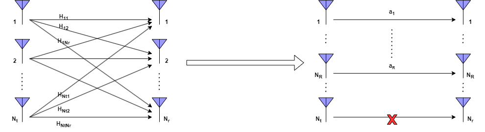
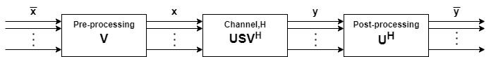

Spatial multiplexing is a technique used in wireless communication systems to transmit multiple data streams simultaneously over the same radio frequency channel. Instead of using different frequencies or time slots, spatial multiplexing equips multiple antennas at both the transmitter and receiver to create independent communication links. By exploiting the spatial dimension, it allows multiplexing of multiple data streams and hence provides an increased transmission rate (or improved spectral efficiency), making it a fundamental technique in modern wireless communication standards like Multiple Input Multiple Output (MIMO) systems.

 
Assuming the knowledge of the channel state information (CSI) at the transmitter, we can convert the MIMO channel into multiple non-interfering parallel SISO channels via singular value decomposition (SVD) based pre-processing and post-processing at the transmitter and receiver, respectively.

Consider a MIMO system with $N_t$ antennas at the transmitter and $N_r$ antennas at the receiver. Let the signal received at the receiver be 

$$\mathbf{y} = \mathbf{Hx} + \mathbf{n}$$

where $\mathbf{x}\in\mathbb{C}^{N_t\times1}$ is the transmitted signal vector, $\mathbf{H}\in\mathbb{C}^{N_r\times N_t}$ is the MIMO channel matrix, and $\mathbf{n}\in\mathbb{C}^{N_r\times1}$ is the AWGN noise with variance $\sigma_N^2$. Without loss of generality, we assume unit transmission power, i.e. $\mathbb{E}[\mathbf{x}^T\mathbf{x}]=1$.
 
From matrix theory, the channel matrix can be decomposed using SVD as

$$\mathbf{H} = \mathbf{USV}^H$$

where $\mathbf{U}\in\mathbb{C}^{N_r\times N_r}$ and $\mathbf{V}\in\mathbb{C}^{N_t\times N_t}$ are unitary matrices (i.e $\mathbf{U}^H\mathbf{U}=1$ and $\mathbf{V}^H\mathbf{V}=1$) and $\mathbf{S}\in\mathbb{C}^{N_r\times N_t}$ is a diagonal matrix with singular values as its entries. There exist $R$ singular values where $R$ is the rank of the matrix H. The received signal can now be written as

$$\mathbf{y} = \mathbf{USV}^H\mathbf{x} + \mathbf{n}$$

1) Pre-processing at the transmitter

    a) Let $\mathbf{x}=\mathbf{V\bar{x}}$

    b) The received signal is now modified as

$$\mathbf{y} = \mathbf{US}\mathbf{\bar{x}} + \mathbf{n}$$

2) Post-processing at the receiver

    a) Let $\mathbf{\bar{y}}=\mathbf{U}^H\mathbf{y}$

    b) The received signal is now modified as 
     
$$\mathbf{\bar{y}} = \mathbf{S}\mathbf{\bar{x}} + \mathbf{\bar{n}}$$

It can be observed that the transmit precoding and receiver shaping transform the MIMO channel into $R$ non-interfering parallel single-input single-output (SISO) channels with input $\mathbf{\bar{x}}$ and output $\mathbf{\bar{y}}$.
 
 

The conversion process is summarized in the below figure.

## MIMO Capacity
The capacity of a MIMO communication system can be expressed as

$$\mathrm{C} = \sum_{i=1}^{R}B\log_2\left(1+\frac{P_ta_i^2}{R\sigma_n^2}\right)$$

where $P_t$ is the total transmission power and $\sigma_n^2$ is the noise power.
